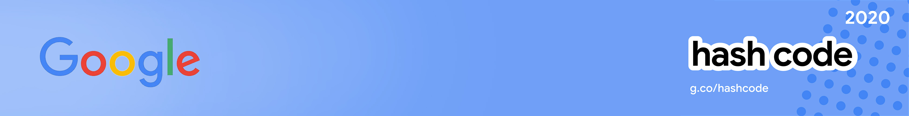

# Google HashCode Challenges
My solutions for attemped HashCodeChallenges

### Description
Hash Code is a team programming competition organized by Google for students and industry professionals across Europe, the Middle East and Africa. You pick your team and programming language, we pick a Google engineering problem for you to solve. The competition takes place over two rounds:

### Solved Problems Set
#### More Pizza
More pizza hash code practice problem.  
Current score : **1 505 000 231**
